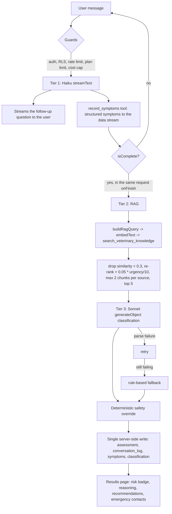

<div align="center">


# PitsyPet

**AI-powered veterinary symptom triage for Australian dog and cat owners.**

Describe what your pet is doing, in your own words. PitsyPet extracts the clinical
signs, grounds them in veterinary knowledge, classifies the risk as Low / Medium / High,
and tells you whether this is home care or a trip to the vet, right now.

[](https://nextjs.org)
[](https://react.dev)
[](https://www.typescriptlang.org)
[](https://supabase.com)
[](https://www.anthropic.com)
[](https://stripe.com)
[](#testing)

[Live app](https://pitsypet.andreshenao.com.au) · [Features](#features) · [How the triage engine works](#how-the-triage-engine-works) · [Getting started](#getting-started) · [Deployment](#deployment)

</div>

---

> [!IMPORTANT]
> **PitsyPet is an educational triage tool, not a diagnosis.** It does not replace a
> veterinarian. The system is deliberately biased to escalate when uncertain, because a
> missed emergency is far worse than an unnecessary vet visit. If your pet is in distress,
> contact an emergency veterinary clinic immediately.

---

## Table of contents

- [Overview](#overview)
- [Features](#features)
- [How the triage engine works](#how-the-triage-engine-works)
- [Safety invariants](#safety-invariants)
- [Tech stack](#tech-stack)
- [Project structure](#project-structure)
- [Getting started](#getting-started)
  - [Prerequisites](#prerequisites)
  - [1. Clone and install](#1-clone-and-install)
  - [2. Configure environment variables](#2-configure-environment-variables)
  - [3. Set up the database](#3-set-up-the-database)
  - [4. Set up Stripe (optional for local use)](#4-set-up-stripe-optional-for-local-use)
  - [5. Run the app](#5-run-the-app)
- [Environment variables](#environment-variables)
- [Database and migrations](#database-and-migrations)
- [RAG knowledge ingestion](#rag-knowledge-ingestion)
- [Plans and usage limits](#plans-and-usage-limits)
- [Security model](#security-model)
- [Available scripts](#available-scripts)
- [Testing](#testing)
- [Deployment](#deployment)
- [Monitoring and observability](#monitoring-and-observability)
- [Troubleshooting](#troubleshooting)
- [Project status](#project-status)
- [Documentation](#documentation)
- [Contributing conventions](#contributing-conventions)
- [License](#license)

---

## Overview

Pet owners face a recurring, stressful question: *is this serious enough to see a vet?*
Search engines answer with worst-case results, and after-hours clinics are expensive.
PitsyPet sits in that gap with a structured, conversational triage that behaves like a
careful vet nurse on the phone.

A user registers, creates pet profiles (species, breed, age, weight, existing conditions),
and starts an assessment. The AI asks targeted follow-up questions, extracts structured
symptoms as the conversation progresses, retrieves relevant veterinary guidance through
vector search, classifies the risk, and then applies a deterministic safety override that
can only escalate the result. Every completed assessment is stored as an immutable
clinical snapshot that becomes part of the pet's living medical history.

Around that core, the app is a small clinical record system: medications, vet clinics and
doctors, appointments, an active-symptom tracker reconciled by the AI, follow-up
assessments, full-text searchable history, and a deterministic vet-facing PDF handover.

## Features

### Triage and AI

- **Conversational symptom intake.** One streaming request per message extracts structured
  symptoms and streams the follow-up question at the same time, so the symptom sidebar
  updates live.
- **RAG grounding.** Symptoms are embedded and matched against a pgvector knowledge base
  with HNSW indexing, similarity filtering, urgency re-ranking, and per-source diversity.
- **Risk classification.** Low / Medium / High with clinical reasoning, produced by a
  structured-output call and validated against a schema.
- **Deterministic safety override.** A regex rubric of emergency presentations (clinical,
  plain English and Australian phrasing) forces High. It can never lower a result.
- **Rule-based fallback.** If the model fails twice, a deterministic classifier still
  returns a safe result. The AI failing never means the user gets nothing.
- **Contextual assistant.** A separate chat on each pet page that can read the pet's full
  record (conditions, medications, clinics, appointments, past assessments, active
  symptoms) and reconcile the active-symptom tracker.

### Clinical record

- **Pet profiles** with breed autocomplete, soft delete, restore, and permanent purge.
- **Medications** with derived active state, **vet clinics and doctors** with service
  hours, and **appointments** with outcomes.
- **Active symptom tracker** kept in sync by both the triage flow and the assistant chat.
- **Assessment history** with full-text and trigram search through a parameterised RPC.
- **Vet PDF export**, assembled deterministically from the stored assessment, so it is
  instant, free, and immune to serverless timeouts.

### Product and platform

- **Public landing site** with scroll-snap sections, an emergency clinic map
  (Leaflet / OpenStreetMap), and a contact form.
- **Subscriptions** through Stripe Checkout and the Customer Portal, with webhook
  reconciliation and server-only plan writes.
- **Legal and privacy surfaces**: `/privacy`, `/terms`, and self-service account deletion
  that cancels the Stripe subscription and cascades the user's data.
- **Abuse and cost controls**: per-route rate limiting, a global daily AI spend cap, bot
  and shield protection on AI routes, and strict CSP with per-request nonces.

## How the triage engine works



Key design points:

| Decision | Why |
|---|---|
| One `streamText` call per message instead of three blocking calls | The user sees a reply immediately while structured extraction happens in the same pass. |
| Classification runs in `onFinish` | It fires even if the client disconnects, so results always persist server-side. |
| RAG failure is non-fatal | Zero chunks or a thrown call simply means classification proceeds without retrieved context. |
| Two models | `claude-haiku-4-5-20251001` for extraction and conversation, `claude-sonnet-4-6` for risk classification. |
| Embeddings | `text-embedding-3-small` (1536 dimensions) with an HNSW `vector_cosine_ops` index. |

## Safety invariants

These are non-negotiable and covered by explicit tests:

1. **The safety override can only escalate.** `hasCriticalSymptom(text)` forces `High` and
   never lowers a classification.
2. **`confidence_score` is logged only.** It gates nothing. Uncertainty rounds risk **up**,
   never down.
3. **Urgency is a re-ranking signal, never a retrieval gate.** A knowledge chunk is never
   hidden because of its urgency level, and `search_veterinary_knowledge` contains no
   urgency `WHERE` clause.
4. **Assessments are immutable snapshots.** Chats and follow-ups read them and append.
   They never rewrite a prior snapshot.
5. **The AI must always be able to read the full pet record** so it never gives advice that
   contradicts a known condition or medication.

## Tech stack

| Layer | Choice |
|---|---|
| Framework | Next.js 15 (App Router, React 19, TypeScript) |
| AI orchestration | Vercel AI SDK v4 (`ai@^4`, `@ai-sdk/*@^1`) |
| Models | Anthropic Claude Haiku 4.5 and Sonnet 4.6, OpenAI `text-embedding-3-small` |
| Database | Supabase Postgres with pgvector (HNSW), Auth, and Row Level Security |
| Cache and limits | Upstash Redis (rate limiting, daily cost guard, usage counters) |
| Styling | Tailwind CSS v4 (CSS-first) with shadcn "base-nova" on Base UI |
| Payments | Stripe Checkout, Customer Portal, and webhooks |
| Email | Nodemailer over Gmail SMTP (landing contact form) |
| PDF | `@react-pdf/renderer` rendered in the browser |
| Maps | Leaflet with OpenStreetMap tiles |
| Monitoring | Sentry (errors), PostHog (privacy-minimised analytics), UptimeRobot on `/api/health` |
| Testing | Vitest |
| Hosting | Vercel |

> [!WARNING]
> **Do not run `npm install ai@latest`.** The AI SDK is pinned to v4 on purpose. v5 renames
> `streamText`, `createDataStreamResponse` and `useChat`, which this codebase depends on.

## Project structure

```
pitsypet/
├── src/
│   ├── app/
│   │   ├── page.tsx                 # public landing page
│   │   ├── privacy/  terms/         # public legal pages
│   │   ├── (auth)/                  # login, register, auth callback
│   │   ├── (dashboard)/dashboard/   # overview, pets, clinics, appointments,
│   │   │                            # history, billing, account, help
│   │   ├── (app)/                   # protected pet, assessment and results pages
│   │   └── api/                     # route handlers (assessment, assistant, pets,
│   │                                # vet-contacts, search, billing, account, health)
│   ├── components/
│   │   ├── landing/  auth/  dashboard/  pets/  vet/  appointments/
│   │   ├── assessment/              # chat UI, symptom sidebar, results, PDF export
│   │   ├── assistant/               # contextual chat widgets
│   │   └── ui/                      # shadcn base-nova kit
│   ├── lib/
│   │   ├── ai/                      # rag, classifier, safety, fallback, format, embed
│   │   ├── billing/                 # checkout and subscription state
│   │   ├── export/                  # deterministic vet summary builder
│   │   ├── supabase/                # server, client, middleware, admin clients
│   │   ├── validations/             # Zod schemas shared by forms and API routes
│   │   ├── plan-limits.ts  rate-limit.ts  cost-guard.ts  arcjet.ts
│   │   └── security/csp.ts
│   ├── types/database.ts            # generated Supabase types
│   └── middleware.ts                # session refresh and route protection
├── supabase/migrations/             # the schema source of truth
├── scripts/                         # RAG ingestion, chunking, schema verification
├── docs/                            # dev plan, dev log, manual testing, vet protocol
└── public/                          # logo and landing imagery
```

## Getting started

### Prerequisites

| Requirement | Notes |
|---|---|
| Node.js 20 or newer | Node 22 recommended |
| npm | Ships with Node |
| A Supabase project | Free tier is enough. pgvector is enabled by a migration. |
| An Anthropic API key | Triage and assistant chat |
| An OpenAI API key | Embeddings only |
| An Upstash Redis database | Rate limiting, cost guard, usage counters |
| A Stripe account (optional) | Only needed to exercise billing flows |

### 1. Clone and install

```bash
git clone https://github.com/cryptotweezer/pitsypet.git
cd pitsypet
npm install
```

### 2. Configure environment variables

```bash
cp .env.example .env.local
```

Fill in at least the required values listed in [Environment variables](#environment-variables).
`.env.local` is git-ignored and must never be committed.

### 3. Set up the database

Migrations in `supabase/migrations/` are the source of truth. Never edit schema in the
Supabase dashboard SQL editor, that creates drift.

```bash
# Link the CLI to your Supabase project (project ref is in the dashboard URL)
npx supabase link --project-ref <your-project-ref>

# Apply every migration to the remote database
npx supabase db push

# Confirm local and remote are in sync
npx supabase migration list

# Regenerate the TypeScript types (commit the result)
npx supabase gen types typescript --linked > src/types/database.ts
```

Optional smoke check that the expected tables, RPCs and policies exist (prints no secrets):

```bash
node scripts/verify-phase1.mjs
```

**Auth configuration in the Supabase dashboard:**

1. Authentication → URL Configuration → Site URL: `http://localhost:3000` for local work,
   your production URL for the live project.
2. Add `http://localhost:3000/auth/callback` and `<your-domain>/auth/callback` to the
   redirect allow list.
3. Signup automatically creates a `profiles` row through the `handle_new_user` trigger,
   no extra setup is needed.

### 4. Set up Stripe (optional for local use)

There is **no manual product setup**. The PitsyPremium price (AUD $9.99 per month) is
looked up by the stable key `pitsypet_premium_monthly` and created automatically on first
use, in test mode and again in live mode.

1. Put your test secret key in `STRIPE_SECRET_KEY` (`sk_test_...`).
2. Forward webhooks locally and copy the printed signing secret into `STRIPE_WEBHOOK_SECRET`:

```bash
stripe listen --forward-to localhost:3000/api/billing/webhook
```

The webhook handles `checkout.session.completed`, `customer.subscription.updated` and
`customer.subscription.deleted`. Going live is an env-var swap to `sk_live_...`, with no
code change.

### 5. Run the app

```bash
npm run dev
```

Open [http://localhost:3000](http://localhost:3000).

A full local smoke path: register an account, create a pet, start an assessment, describe a
mild symptom, complete the conversation, and confirm the results page renders and the
assessment appears in history.

## Environment variables

Copy `.env.example` to `.env.local`. Every variable must also be set in Vercel for both
**Production and Preview**, otherwise branch deployments fail on AI calls.

### Required

| Variable | Purpose |
|---|---|
| `NEXT_PUBLIC_SUPABASE_URL` | Supabase project URL |
| `NEXT_PUBLIC_SUPABASE_ANON_KEY` | Anon key used by the cookie-scoped clients (RLS enforced) |
| `SUPABASE_SERVICE_ROLE_KEY` | Ingestion scripts and the Stripe webhook plan writer only. Bypasses RLS, never expose it to the client. |
| `ANTHROPIC_API_KEY` | Claude models for extraction, chat and classification |
| `OPENAI_API_KEY` | Embeddings only |
| `UPSTASH_REDIS_REST_URL` | Rate limiting, cost guard, usage counters |
| `UPSTASH_REDIS_REST_TOKEN` | As above |
| `NEXT_PUBLIC_APP_URL` | Absolute base URL used for redirects and Stripe return URLs |

### Billing

| Variable | Purpose |
|---|---|
| `STRIPE_SECRET_KEY` | `sk_test_...` for test mode, `sk_live_...` for real payments |
| `STRIPE_WEBHOOK_SECRET` | Signature verification for `POST /api/billing/webhook` |

### Optional

| Variable | Purpose |
|---|---|
| `ARCJET_KEY` | Bot detection and shield on AI routes. Routes still work without it. |
| `NEXT_PUBLIC_SENTRY_DSN` | Error tracking. The SDK is a no-op when unset. |
| `SENTRY_AUTH_TOKEN` | Source map upload during CI or production builds |
| `NEXT_PUBLIC_POSTHOG_KEY` | Product analytics. No-op when unset. |
| `NEXT_PUBLIC_POSTHOG_HOST` | Defaults to `https://us.i.posthog.com` |
| `GMAIL_USER` | Gmail address used as the sender for the landing contact form |
| `GMAIL_APP_PASSWORD` | Gmail App Password, not the account password |
| `CONTACT_TO_EMAIL` | Where enquiries are delivered. Defaults to `GMAIL_USER`. |

## Database and migrations

The schema lives entirely in `supabase/migrations/`. Core tables:

| Table | Contents |
|---|---|
| `profiles` | User profile, Australian state, plan and Stripe identifiers |
| `pets` | Pet profiles with slug, soft delete, and species-aware fields |
| `assessments` | Immutable triage snapshots, `conversation_log` JSONB, extracted symptoms, classification, follow-ups |
| `active_symptoms` | The pet's currently tracked signs, reconciled by triage and chat |
| `medications`, `appointments` | Ongoing treatment and scheduled care |
| `vet_contacts`, `vet_doctors` | Clinics with service hours and their doctors |
| `veterinary_knowledge` | RAG chunks with embeddings and urgency levels |
| `breeds`, first-aid and emergency lookups | Read-only reference data |
| `knowledge_processing_audit` | Ingestion audit, RLS on with no policy (deny-all by design) |

Key routines:

- `search_veterinary_knowledge` - vector similarity search with no urgency gate.
- `search_assessments` - full-text plus trigram search, `SECURITY INVOKER`, parameterised
  through `plainto_tsquery` and therefore injection-safe. The `assessments` FTS GIN index
  expression is byte-identical to the expression inside the function. If you change one,
  change both or the index stops being used.
- `delete_own_account(text)` - `SECURITY DEFINER` with an empty `search_path`, derives the
  user from `auth.uid()`, requires the literal confirmation `DELETE`, and is granted only
  to `authenticated`.
- `handle_new_user` and `set_updated_at` triggers.

> After **any** schema change, regenerate `src/types/database.ts` and commit it.

## RAG knowledge ingestion

The ingestion pipeline shares the runtime embedding code in `src/lib/ai/embed.ts`.

1. Place vetted veterinary source documents (PDF or text) in `scripts/sources/`. That
   directory is git-ignored, source documents are not redistributed with the repository.
2. Run the ingestion:

```bash
npm run ingest
```

The script cleans and chunks each document, embeds in batches of 96, and bulk-inserts into
`veterinary_knowledge` using the service-role key. This is the only place in the project
where that key touches ingestion.

> [!NOTE]
> **The repository ships no knowledge content, by design.** Source documents are not
> redistributable, so `scripts/sources/` is git-ignored and a fresh clone starts with an
> empty `veterinary_knowledge` table. Retrieval is a non-fatal tier: with zero chunks the
> classifier still runs, defaults to caution, and the safety override still applies.
>
> The live deployment runs a small provisional corpus (121 chunks from 3 veterinary triage
> sources) that exists to exercise retrieval end to end with real clinical text. It is not
> the production corpus: those licences do not cover commercial redistribution, and three
> documents cannot span what owners actually describe. The production set is purchased
> veterinary reference material.
>
> Content quality is the single biggest lever on triage calibration, and curating it, along
> with the Low / Medium / High rubric that consumes it, is clinical work driven by a
> veterinarian. Calibration happens through RAG grounding and prompt rubrics only. No model
> is fine-tuned, and symptoms are never hardcoded.

## Plans and usage limits

`src/lib/plan-limits.ts` is the single source of truth. Landing and billing copy mirror
these numbers, so change them together.

| | PitsyBasic | PitsyPremium (AUD $9.99 / month) |
|---|---|---|
| New AI triage sessions | 2 per month | Unlimited |
| Assistant chat messages | 10 per day | Unlimited |
| Pet profiles | 1 | Unlimited |
| Vet PDF exports | Unlimited | Unlimited |

Behaviour rules:

- A triage session, once started, is **never** cut off mid-conversation. The monthly cap
  gates starting a new assessment. Messages inside it are free, and follow-ups count as
  part of the original session.
- The daily assistant allowance resets at the user's local midnight, using the timezone the
  browser reports.
- Limit failures return `403 { code: "plan_limit" }` so the UI can present an upgrade path
  rather than a generic error.

Additional protection layers:

| Guard | Limit |
|---|---|
| `chatRateLimiter` | 20 requests per minute |
| `searchRateLimiter` | 30 per minute |
| `exportRateLimiter` | 10 per minute |
| `billingRateLimiter` | 10 per minute |
| `contactRateLimiter` | 5 per 10 minutes, keyed by IP |
| Global cost guard | 200 assessments per day across the whole app |

## Security model

- **Row Level Security on every table.** Users can only reach their own profile and
  clinical records. Lookup tables are read-only to authenticated users.
- **One client rule.** All application data access goes through the cookie-scoped server
  client in `src/lib/supabase/server.ts`, so RLS is always enforced.
- **Service-role containment.** `SUPABASE_SERVICE_ROLE_KEY` is used in `scripts/` and in
  exactly one documented exception, `src/lib/supabase/admin.ts`, imported solely by
  `src/lib/billing/subscription.ts`, because Stripe webhooks have no user session and
  billing columns are deliberately not writable by `authenticated`. This is enforceable:

  ```bash
  grep -r SERVICE_ROLE_KEY src/   # must match ONLY src/lib/supabase/admin.ts
  ```

- **Never trust client-supplied ownership.** The chat routes re-fetch the pet by id through
  the cookie-scoped client so RLS verifies ownership server-side.
- **Content Security Policy** with per-request nonces (`src/lib/security/csp.ts`).
  Production `script-src` carries `'wasm-unsafe-eval'` because the PDF renderer compiles
  WebAssembly in the browser. That flag enables WASM only and does not enable JavaScript
  `eval()`.
- **Input validation** with Zod on every mutating route, shared with the client forms.
- **Account deletion** cancels the Stripe customer first, then calls `delete_own_account`,
  which cascades the user's live application data.

## Available scripts

| Command | What it does |
|---|---|
| `npm run dev` | Local development server on port 3000 |
| `npm run build` | Production build, also runs `tsc`. Must be zero TypeScript and zero ESLint errors. |
| `npm start` | Serve a production build |
| `npm run lint` | ESLint through `next lint` |
| `npx tsc --noEmit` | Type-check only |
| `npm test` | Run the Vitest suite once |
| `npm run test:watch` | Vitest in watch mode |
| `npm run ingest` | RAG ingestion from `scripts/sources/` |
| `npm run spike` | Ad-hoc triage flow script for manual experimentation |
| `node scripts/verify-phase1.mjs` | Remote schema smoke check, prints no secrets |

## Testing

```bash
npm test
```

**180 tests across 16 files**, covering:

- Triage safety: the override escalates and never de-escalates, across clinical, plain and
  Australian phrasings.
- A triage regression set of representative presentations.
- RAG filtering, re-ranking and diversity rules.
- The rule-based fallback classifier.
- Prompt formatting helpers and Zod schemas.
- Active-symptom reconciliation and medication active-state derivation.
- API route handlers: pets, symptoms, medications, appointments, vet contacts, search,
  billing and account deletion.

Manual test scripts live in `docs/manual_testing.md`.

## Deployment

The app is deployed on Vercel at
[https://pitsypet.andreshenao.com.au](https://pitsypet.andreshenao.com.au).

1. **Import the repository into Vercel.** The framework preset is detected automatically.
2. **Add every environment variable** to both Production and Preview.
3. **Set `NEXT_PUBLIC_APP_URL`** to the production domain.
4. **Update Supabase Auth URLs** with the production Site URL and the
   `<domain>/auth/callback` redirect.
5. **Create the Stripe webhook endpoint** pointing at `<domain>/api/billing/webhook`,
   subscribe to `checkout.session.completed`, `customer.subscription.updated` and
   `customer.subscription.deleted`, then copy the signing secret into
   `STRIPE_WEBHOOK_SECRET`.
6. **Apply migrations to the production database** with `npx supabase db push`.
7. **Point UptimeRobot at `/api/health`** every 5 minutes. The probe round-trips a trivial
   read, which also keeps a free-tier Supabase project from auto-pausing.
8. **Smoke test** register, login, pet creation, a full assessment, PDF export, upgrade and
   cancel, and account deletion with a disposable account.

## Monitoring and observability

| Tool | Coverage |
|---|---|
| Sentry | Browser, server and edge runtimes, plus a global error boundary. No-op without a DSN, and disabled in development. |
| PostHog | Privacy-minimised product events, typed in `src/lib/analytics.ts`. No free-text symptom content is ever sent. |
| UptimeRobot | `GET /api/health` returns `200` with database reachability, or `503` when the database is unreachable. |

## Troubleshooting

<details>
<summary><strong>Local requests fail with <code>UNABLE_TO_VERIFY_LEAF_SIGNATURE</code> or "self-signed certificate in certificate chain"</strong></summary>

Antivirus software that inspects HTTPS (Norton, Kaspersky, ESET and similar) re-signs TLS
with its own root certificate, which Node does not trust by default.

**Fix:** set the user-level environment variable `NODE_OPTIONS=--use-system-ca`. Node 22
then trusts the Windows certificate store, where the interception root already lives. New
terminals pick it up automatically. This affects `supabase-js` scripts, `npm run ingest`
and the Gmail SMTP contact form in development.

**Never** use `NODE_TLS_REJECT_UNAUTHORIZED=0`. It disables all TLS verification and opens
a real MITM risk. Production on Vercel needs nothing special.
</details>

<details>
<summary><strong>Styles look broken even though the build passes</strong></summary>

This project is CSS-first **Tailwind v4**. There is intentionally **no `tailwind.config.ts`**,
and `components.json` sets `tailwind.config: ""`. Tokens live in `src/app/globals.css` under
`@theme inline`, and animations come from `tw-animate-css`.

Do not reintroduce a v3 config, `tailwindcss-animate`, or `@import "shadcn/tailwind.css"`.
Tailwind v3 silently ignores unknown utilities, so a green build does not prove the styles
render. Add components with `npx shadcn@latest add <name>` to keep the base-nova style.
</details>

<details>
<summary><strong>PDF export works locally but fails in production</strong></summary>

Two historical causes, both fixed and worth knowing:

1. The export used to make a per-download AI call with no `maxDuration`, which died at the
   default serverless timeout. The summary is now assembled deterministically from the
   stored assessment.
2. Production CSP blocked the renderer's WebAssembly. Production `script-src` now includes
   `'wasm-unsafe-eval'`. Development never hit this because the development CSP already
   allows `'unsafe-eval'` for hot reloading.

If richer AI prose is ever wanted in the export, generate it once at assessment completion
and store it. Never per download.
</details>

<details>
<summary><strong>Streaming, <code>useChat</code> or tool calls break after a dependency update</strong></summary>

Check that `ai` is still on `^4` and `@ai-sdk/*` on `^1`. AI SDK v5 renamed the streaming
APIs this codebase is built on. Roll back the pin rather than migrating opportunistically.
</details>

<details>
<summary><strong>Assessment history search returns nothing or is slow</strong></summary>

History lists **completed** assessments, meaning `completed_at IS NOT NULL`. Also confirm
the `assessments` FTS GIN index expression still matches the expression inside
`search_assessments` byte for byte. If they diverge, Postgres silently stops using the index.
</details>

## Project status

**PitsyPet is complete and live in production** at
[pitsypet.andreshenao.com.au](https://pitsypet.andreshenao.com.au), built across twelve
phases each gated by its own acceptance checklist in `docs/dev_plan.md`.

| Area | Delivered |
|---|---|
| Platform | Next.js 15 on Vercel, Supabase Postgres with RLS on every table, 32 migrations |
| Authentication | Registration, login, session middleware, protected route groups |
| Clinical record | Pets, medications, clinics and doctors, appointments, active symptoms, follow-ups |
| Triage engine | Streaming extraction, RAG retrieval, risk classification, rule-based fallback, deterministic safety override |
| Results and handover | Risk badge, clinical reasoning, level-matched recommendations, emergency contacts, deterministic vet PDF |
| History | Full-text and trigram search over completed assessments |
| Billing | Stripe Checkout, Customer Portal, webhook reconciliation, server-enforced plan limits |
| Legal and privacy | Public privacy and terms pages, self-service account deletion with Stripe cancellation |
| Security | Five rate limiters, a fail-closed daily spend cap, bot protection, nonce-based CSP, Zod validation |
| Quality | 180 automated tests, zero TypeScript and zero ESLint errors, clinical calibration with a veterinary surgeon |
| Monitoring | Sentry, PostHog, UptimeRobot on `/api/health`, custom production domain |

Two capabilities are intentionally staged for a later release: transactional email through
Resend (custom authentication email and the "request an appointment, email the doctor"
flow), and wiring retrieval into the per-pet assistant chat, which waits on the production
knowledge corpus described above.

> The legal pages are drafts tailored to Australian users with GDPR coverage. Obtain
> professional legal review before relying on them in production.

## Documentation

| Document | Contents |
|---|---|
| `docs/dev_plan.md` | Source of truth for what gets built, phase by phase, with acceptance checklists |
| `docs/DEV_LOG.md` | Session log and current status block, the continuity mechanism |
| `docs/manual_testing.md` | Manual test scripts |
| `docs/vet_protocol.md` | Clinical reference protocol |
| `docs/vet_calibration_notes.md` | Risk thresholds captured with a practising veterinary surgeon, the authority for the triage rubric |
| `docs/proposal_vs_implemented.md` | Where the implementation deliberately diverged from the original proposal |
| `docs/PROPOSAL.md` | The original capstone proposal, historical context only |
| `CLAUDE.md` | Repository guide for AI coding agents: invariants, conventions, bootstrap protocol |

Where `PROPOSAL.md` conflicts with `dev_plan.md`, the plan wins.

## Contributing conventions

- Schema changes go in migrations, never in the dashboard SQL editor. Regenerate and commit
  `src/types/database.ts` afterwards.
- `npm run build` must finish with zero TypeScript and zero ESLint errors before a commit.
- New API routes validate input with Zod, use the cookie-scoped Supabase client, and apply
  the relevant rate limiter and plan check.
- Never weaken the safety invariants. They have tests for exactly that reason.
- Keep `docs/DEV_LOG.md` and the roadmap in `CLAUDE.md` in sync at the end of a working
  session.

## License

Proprietary. All rights reserved. No license is granted for reuse, redistribution or
derivative works without the author's written permission.

---

<div align="center">

<a href="https://cv.andreshenao.com.au">
  <picture>
    <source media="(prefers-color-scheme: dark)" srcset="public/logo_white.png" />
    
  </picture>
</a>

Built by [Andres Henao](https://cv.andreshenao.com.au)

**PitsyPet provides educational triage guidance only and is not a substitute for
professional veterinary care.**

</div>
